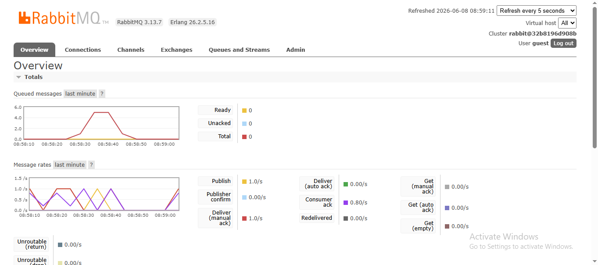

a. What is AMQP?
AMQP (Advanced Message Queuing Protocol) adalah sebuah protokol standar terbuka pada lapisan aplikasi yang digunakan untuk pengiriman pesan antar aplikasi atau sistem (middleware). Protokol ini memungkinkan penyampaian pesan yang aman, andal, dan interoperabel antar platform yang berbeda.

b. What does it mean? guest:guest@localhost:5672

First guest: Merupakan Username default untuk autentikasi ke server RabbitMQ.

Second guest: Merupakan Password default untuk user tersebut.

localhost:5672: Alamat server (localhost) dan port (5672) yang digunakan untuk menerima koneksi RabbitMQ.

**c. Simulation Slow Subscriber**
Berikut adalah *screenshot* dari RabbitMQ saat simulasi *slow subscriber*:

**Mengapa jumlah antrean (Queued messages) bisa melonjak hingga angka tersebut (misal: 20)?**
Dalam simulasi ini, kita mengaktifkan `thread::sleep(ten_millis);` yang memaksa *subscriber* untuk "tertidur" atau memakan waktu *processing* selama 1 detik penuh untuk setiap 1 pesan yang diterimanya. Di sisi lain, setiap kali *publisher* dijalankan (`cargo run`), ia secara instan menembakkan 5 pesan sekaligus.

Jika saya menjalankan *publisher* sebanyak 4 kali secara beruntun dengan sangat cepat, maka akan ada 20 pesan (4 x 5) yang dikirim ke RabbitMQ dalam waktu hampir bersamaan. Karena *subscriber* hanya mampu memproses 1 pesan per detik, sisa pesan yang belum terproses tidak akan dibuang atau membuat sistem *crash*. Sebaliknya, pesan-pesan tersebut ditampung dengan aman di dalam antrean (*queue*) RabbitMQ. Itulah sebabnya grafik merah melonjak tajam menyentuh angka 20, dan perlahan-lahan turun (1 angka per detik) seiring dengan kemampuan *subscriber* menyelesaikan tugasnya satu per satu. Hal ini membuktikan bahwa arsitektur *Event-Driven* sangat efektif menahan lonjakan *traffic* secara tiba-tiba (seperti saat KRS-an / SIAK War).
